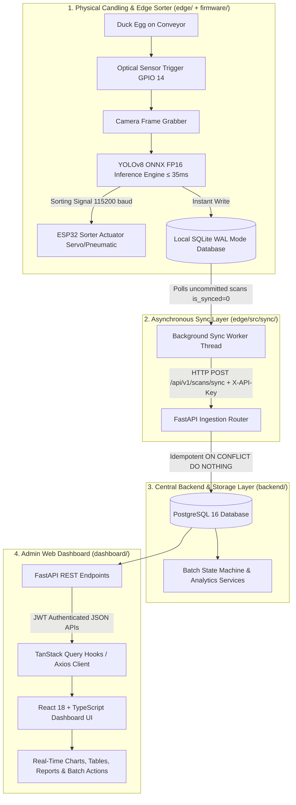

# 🐣 OvaLens System Integration & Dashboard Documentation

> **Subsystem**: `docs/` & `dashboard/`  
> **Topic**: System Integration Architecture, Data Flow, and Dashboard Capabilities  
> **Purpose**: Capstone Research Manuscript, Technical Documentation, and Operator Guide  
> **Institution**: Foundation University  

---

## 📑 Table of Contents
1. [Executive Summary](#-executive-summary)
2. [End-to-End System Architecture & Data Flow](#-end-to-end-system-architecture--data-flow)
   - [Architectural Flowchart](#architectural-flowchart)
   - [Layer-by-Layer Integration Breakdown](#layer-by-layer-integration-breakdown)
3. [Dashboard Features & Module Breakdown](#-dashboard-features--module-breakdown)
   - [1. Overview & Real-Time Hatchery Operations](#1-overview--real-time-hatchery-operations)
   - [2. Batch Lifecycle Management](#2-batch-lifecycle-management)
   - [3. Scan Explorer & Visual Inspector](#3-scan-explorer--visual-inspector)
   - [4. Hatchery Analytics & Intelligence](#4-hatchery-analytics--intelligence)
   - [5. Hatchery Records & Compliance Reporting](#5-hatchery-records--compliance-reporting)
   - [6. Device Fleet & IoT Station Telemetry](#6-device-fleet--iot-station-telemetry)
   - [7. AI Vision Models Registry](#7-ai-vision-models-registry)
   - [8. User Access Control (RBAC)](#8-user-access-control-rbac)
   - [9. Audit Trail & System Security Logs](#9-audit-trail--system-security-logs)
   - [10. Hatchery & System Settings](#10-hatchery--system-settings)
4. [Hardware & Software Subsystem Mapping](#-hardware--software-subsystem-mapping)
5. [Data Protocol & Synchronization Specifications](#-data-protocol--synchronization-specifications)
6. [Brand Identity & UI Tokens](#-brand-identity--ui-tokens)

---

## 🌟 Executive Summary

**OvaLens** is an automated, industrial-grade duck egg candling, fertility classification, and hatchery analytics ecosystem developed for Foundation University. The **OvaLens Dashboard** serves as the central control and data visualization portal for hatchery supervisors, operators, and quality auditors. It provides live monitoring of automated candling operations, batch developmental lifecycles, economic salvage yield forecasting (Day-10 *Penoy* valuation), and hardware fleet telemetry.

---

## 🔄 End-to-End System Architecture & Data Flow

The OvaLens ecosystem operates on an **Offline-First, Real-Time Edge-to-Cloud/Central Server pipeline**. Data flows smoothly from the physical candling conveyor belt to the local edge computer, central FastAPI REST backend, and browser dashboard.

### Architectural Flowchart



### Layer-by-Layer Integration Breakdown

#### Layer 1: Physical Trigger & Edge AI Inference
1. As a duck egg moves along the conveyor over the high-lumen candling light, an infrared optical sensor detects its presence and triggers a hardware interrupt on the **ESP32** (GPIO 14 with a 600ms debounce lockout).
2. The camera frame grabber captures a high-resolution candling frame.
3. The **ONNX Runtime FP16 Inference Engine** classifies the egg into one of three strict biological classes within $\le 35\text{ms}$:
   - **`FERTILE`**: Active embryo with visible blood vessels/spider veins $\rightarrow$ **Action: `ACCEPT`** (continues to incubator).
   - **`INFERTILE`**: Clear, unfertilized yolk / *bugok* $\rightarrow$ **Action: `REJECT`** (routed to Day-10 *Penoy* salvage bin).
   - **`ABNORMAL`**: Dead embryo, blood ring, or ruptured yolk $\rightarrow$ **Action: `REJECT`** (routed to early discard bin).
4. A non-blocking sorting command is dispatched over PySerial (115200 baud) to the ESP32 to actuate the diverter mechanism.

#### Layer 2: Offline-First Local Persistence
1. The inference result, confidence score, bounding box JSON, session ID, sequence number, and timestamp are **immediately saved to a local SQLite database** running in **WAL (Write-Ahead Logging)** mode.
2. The record is flagged with `is_synced = 0`.
3. **Resilience Guarantee**: Physical sorting speed on the conveyor is completely decoupled from network availability. Even during internet/LAN outages, sorting operates at full speed without dropping records.

#### Layer 3: Background Network Synchronization (`edge` $\rightarrow$ `backend`)
1. A dedicated background thread (`BackgroundSyncWorker`) runs every 3 seconds.
2. It queries up to 50 uncommitted scans (`is_synced = 0`) from local SQLite.
3. The worker packages the records into a `ScanSyncPayload` JSON bundle and dispatches an `HTTP POST` request to `http://<backend-ip>:8000/api/v1/scans/sync` with `X-API-Key` authentication.
4. The central **FastAPI** backend ingests the payload using PostgreSQL `ON CONFLICT (scan_id) DO NOTHING` to guarantee idempotency.
5. Upon receiving an `HTTP 200 OK` acknowledgment, the worker marks the respective local records as `is_synced = 1`.

#### Layer 4: Backend Aggregation & Analytics
1. The backend stores scans across relational models: `devices`, `batches`, `sessions`, `scans`, and `audit_logs`.
2. Asynchronous aggregation services update batch-level metrics: overall fertility rate, fertility-by-breed, Day-10 salvageable revenue, and candling speed (eggs/minute).
3. Endpoints deliver JWT-authenticated data to web clients.

#### Layer 5: Web Dashboard Presentation (`backend` $\rightarrow$ `dashboard`)
1. The **React 18 Dashboard** uses **TanStack Query (React Query)** and Axios to query backend REST endpoints.
2. Data is cached in client memory and polled at configurable intervals, ensuring real-time operational visibility without full-page reloads.
3. Interactive UI widgets (Recharts, dynamic modals, data tables) render the telemetry.

---

## 🖥️ Dashboard Features & Module Breakdown

| Page / Route | File | Key Capabilities & Features |
| :--- | :--- | :--- |
| **Overview** (`/`) | [`OverviewPage.tsx`](file:///d:/Ryle_Gabotero/side_projects/Capstone/dashboard/src/pages/OverviewPage.tsx) | Real-time KPI stat cards (Total Eggs Scanned, Overall Fertility %, Infertility %, Abnormal Rate), active batch quick monitor, live candling activity feed stream, and hardware health indicator. |
| **Batches** (`/batches`) | [`BatchesPage.tsx`](file:///d:/Ryle_Gabotero/side_projects/Capstone/dashboard/src/pages/BatchesPage.tsx) | 28-day developmental lifecycle state machine (`CREATED` $\rightarrow$ `CANDLING` $\rightarrow$ `INCUBATING` $\rightarrow$ `HATCHED` $\rightarrow$ `COMPLETED`), egg breed categorization (Mallard/*Itik*, Pekin, Muscovy), Day-10 *Penoy* economic salvage value calculator, and batch creation modal. |
| **Scan Explorer** (`/scans`) | [`ScanExplorerPage.tsx`](file:///d:/Ryle_Gabotero/side_projects/Capstone/dashboard/src/pages/ScanExplorerPage.tsx) | Egg-by-egg searchable audit table, multi-parameter filtering (by biological class, confidence, date range, device), candling image viewer modal with bounding box overlay and inference latency breakdown, CSV export. |
| **Analytics** (`/analytics`) | [`AnalyticsPage.tsx`](file:///d:/Ryle_Gabotero/side_projects/Capstone/dashboard/src/pages/AnalyticsPage.tsx) | Longitudinal fertility trend lines, 3-class biological proportion charts (Embryo vs Bugok vs Dead Germ), candling throughput rate (eggs/min), inference speed profiles, and supplier flock fertility benchmarks. |
| **Records** (`/records`) | [`RecordsPage.tsx`](file:///d:/Ryle_Gabotero/side_projects/Capstone/dashboard/src/pages/RecordsPage.tsx) | Official hatchery compliance records archive, export engine for formal PDF batch certificates and full CSV datasets for research and regulatory reporting. |
| **Devices** (`/devices`) | [`DevicesPage.tsx`](file:///d:/Ryle_Gabotero/side_projects/Capstone/dashboard/src/pages/DevicesPage.tsx) | Edge station fleet management, real-time online/offline heartbeat, PySerial connection health, firmware/model weight version tracking, and station sync queue backlog status. |
| **AI Models** (`/models`) | [`ModelsPage.tsx`](file:///d:/Ryle_Gabotero/side_projects/Capstone/dashboard/src/pages/ModelsPage.tsx) | YOLO ONNX model registry, FP16 deployment benchmarks, mAP@50 and inference latency tracking across model versions. |
| **Users** (`/users`) | [`UsersPage.tsx`](file:///d:/Ryle_Gabotero/side_projects/Capstone/dashboard/src/pages/UsersPage.tsx) | Role-Based Access Control (RBAC) management for `Admin`, `Supervisor`, and `Operator` accounts, password resets, and user status toggles. |
| **Audit Logs** (`/logs`) | [`AuditLogsPage.tsx`](file:///d:/Ryle_Gabotero/side_projects/Capstone/dashboard/src/pages/AuditLogsPage.tsx) | Immutable security audit trail logging authentication events, manual batch state overrides, threshold edits, and hardware configuration updates. |
| **Settings** (`/settings`) | [`SettingsPage.tsx`](file:///d:/Ryle_Gabotero/side_projects/Capstone/dashboard/src/pages/SettingsPage.tsx) | Configurable fertility alert thresholds, incubation timeline parameters, backend API target configuration, and dark/light theme switching. |

---

## 📊 Hardware & Software Subsystem Mapping

```
Capstone/
├── dashboard/               # [Web Application] React 18 + TS + Tailwind + TanStack Query
├── backend/                 # [Central API & DB] FastAPI + PostgreSQL 16 + SQLAlchemy 2.0
├── edge/                    # [Edge Computer Vision] OpenCV + ONNX Runtime FP16 + SQLite WAL
└── firmware/                # [IoT Sorter] ESP32 Dev Module (C++ / Arduino) + Optical Sensor
```

| Layer | Technology Stack | Function in OvaLens Ecosystem |
| :--- | :--- | :--- |
| **Conveyor Sorter** | ESP32, Optical Sensor, Servo Actuator | Real-time egg arrival detection and physical chute routing. |
| **Edge Candling App** | Python 3.11, OpenCV, ONNX Runtime FP16, SQLite WAL | Real-time AI classification ($\le 35\text{ms}$), local operator GUI, and zero-drop offline data storage. |
| **Sync Worker** | Python Threading, Requests, JSON DTOs | Background synchronization of edge scan records to the central server. |
| **Central Backend** | FastAPI, PostgreSQL 16, Pydantic v2, SQLAlchemy 2.0 | Central business logic, idempotent ingestion, batch state machine, and RESTful APIs. |
| **Admin Dashboard** | React 18, Vite, TypeScript, TailwindCSS, Recharts | Executive analytics, batch management, egg inspection, and PDF reporting. |

---

## 🔌 Data Protocol & Synchronization Specifications

### Edge Scan Sync Request
```http
POST /api/v1/scans/sync
Host: <central-server-ip>:8000
Content-Type: application/json
X-API-Key: <EDGE_DEVICE_API_KEY>
```

```json
{
  "scans": [
    {
      "scan_id": "7c9e6679-7425-40de-944b-e07fc1f90ae7",
      "session_id": "18c078a6-80f4-4ea7-9a0f-15591d34c2ab",
      "batch_id": "b0a2cf72-5b91-4d3b-9e45-12e022f42a19",
      "sequence_number": 42,
      "final_class": "FERTILE",
      "confidence": 0.964,
      "inference_ms": 28,
      "routing_action": "ACCEPT",
      "image_url": null,
      "detections": [
        {
          "class": "FERTILE",
          "confidence": 0.964,
          "bbox": [120, 85, 340, 410]
        }
      ],
      "scanned_at": "2026-08-22T20:10:00Z"
    }
  ]
}
```

### Backend Ingestion Response
```http
HTTP/1.1 200 OK
Content-Type: application/json
```

```json
{
  "status": "success",
  "synced_count": 1,
  "acknowledged_scan_ids": [
    "7c9e6679-7425-40de-944b-e07fc1f90ae7"
  ]
}
```

---

## 🏛️ Brand Identity & UI Tokens

| Token Name | Hex Code | Purpose in UI |
| :--- | :--- | :--- |
| **FU Primary Maroon** | `#800000` | Header navbar, primary call-to-action buttons, active navigation states. |
| **FU Dark Maroon** | `#5C0000` | Hover states and dark accents. |
| **Agri-Green (Fertile)** | `#357a38` | `FERTILE` egg status badge, positive trends, high fertility indicators. |
| **Reject Red (Infertile/Abnormal)**| `#DC2626` | `INFERTILE` / `ABNORMAL` badges, rejection alerts, critical warnings. |
| **Slate Dark Theme** | `#0F172A` | Background for dark mode and data card containers. |
| **Clean Light Theme** | `#F8FAFC` | Default crisp background for high readability in hatchery environments. |
