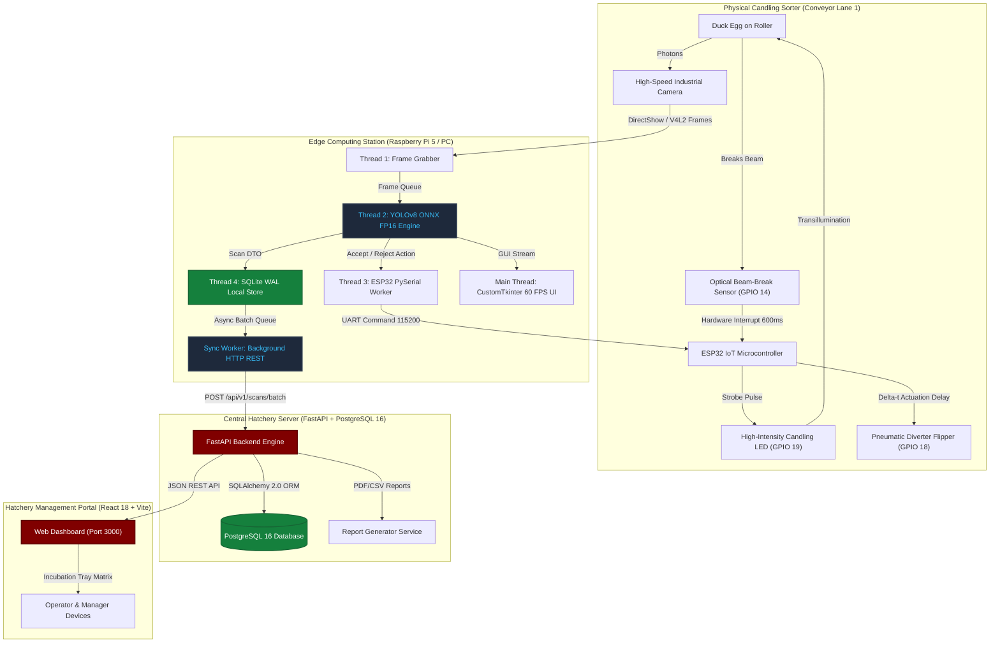
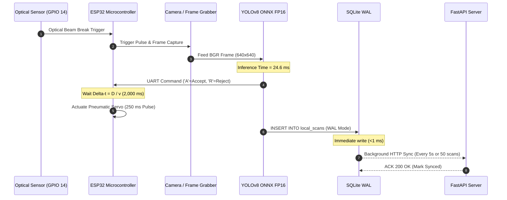

# OvaLens System Diagrams & Architectural Schematics

This directory contains architectural blueprints, hardware wiring schematics, operational flowcharts, and database Entity-Relationship Diagrams (ERDs) for the **OvaLens** Capstone manuscript and defense presentation.

---

## 📁 Diagram Subdirectories

* [`architecture/`](file:///d:/Ryle_Gabotero/side_projects/Capstone/docs/diagrams/architecture): High-level monorepo topology, 4-tier communication, and REST/WebSocket sync models.
* [`hardware_schematics/`](file:///d:/Ryle_Gabotero/side_projects/Capstone/docs/diagrams/hardware_schematics): ESP32 pinouts, relay connections, power rails, and optical beam-break sensor debouncing.
* [`flowcharts/`](file:///d:/Ryle_Gabotero/side_projects/Capstone/docs/diagrams/flowcharts): Edge multi-threading pipeline, candling inference flow, and diverter kinematics state machines.
* [`database_erds/`](file:///d:/Ryle_Gabotero/side_projects/Capstone/docs/diagrams/database_erds): PostgreSQL 16 relational database schema and SQLite WAL edge data models.

---

## 🏛️ 1. High-Level System Architecture Diagram

---

## ⚙️ 2. Edge Multi-Threading & Synchronization Flowchart

