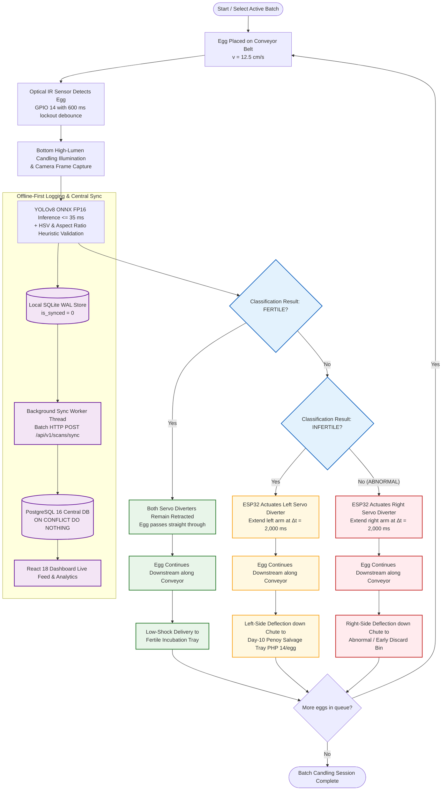

# Fertility Classification & Conveyor Actuation Pipeline

> **Subsystem**: `edge/` + `firmware/` + `backend/` + `dashboard/`  
> **Source Draw.io File**: [`Flowchart-5 - Fertility Classification Pipeline.drawio.svg`](file:///d:/Ryle_Gabotero/side_projects/Capstone/docs/diagrams/flowcharts/Flowchart-5%20-%20Fertility%20Classification%20Pipeline.drawio.svg)  
> **Institution**: Foundation University  

---

## 🔄 Mermaid Flowchart Diagram

---

## 📋 Summary of Pipeline Stages

1. **Egg Intake & Hardware Trigger**:
   - Duck eggs travel along the conveyor belt at continuous velocity ($v = 12.5\text{ cm/s}$).
   - An optical IR sensor triggers a hardware interrupt on the **ESP32** (GPIO 14 with a 600 ms lockout debounce).

2. **Computer Vision & Heuristic Inference**:
   - High-speed camera captures the bottom-candled egg frame.
   - **ONNX Runtime FP16** executes YOLOv8 inference in $\le 35\text{ms}$.
   - Geometric aspect-ratio ($0.65 \le \text{AR} \le 1.45$) and HSV candling luminance heuristics validate the egg boundary.

3. **Offline-First Resilience**:
   - The scan event is immediately committed to **Local SQLite in WAL mode** (`is_synced = 0`).
   - The [`BackgroundSyncWorker`](file:///d:/Ryle_Gabotero/side_projects/Capstone/edge/src/sync/sync_worker.py) thread polls and pushes uncommitted scans every 3 seconds to the central **FastAPI + PostgreSQL 16** backend (`ON CONFLICT (scan_id) DO NOTHING`), updating local state to `is_synced = 1`.

4. **3-Way Sorting Actuation ($\Delta t = D/v = 2,000\text{ ms}$)**:
   - **`FERTILE`**: Both servo diverters remain retracted $\rightarrow$ straight pass into the **Fertile Incubation Tray**.
   - **`INFERTILE`**: ESP32 actuates the left servo diverter $\rightarrow$ deflected into the **Day-10 Penoy Salvage Chute (₱14)**.
   - **`ABNORMAL`**: ESP32 actuates the right servo diverter $\rightarrow$ deflected into the **Early Discard Bin**.
